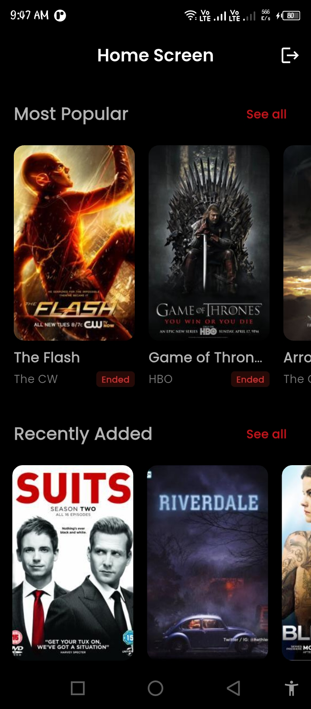
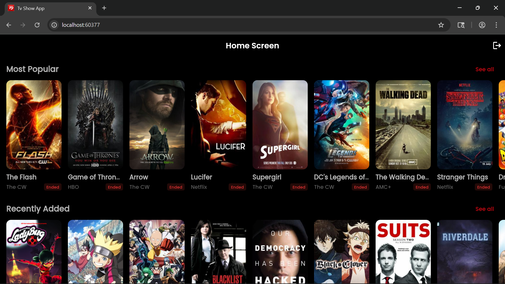
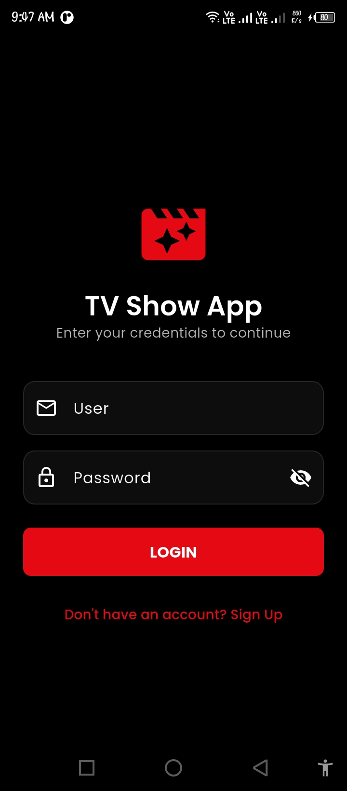
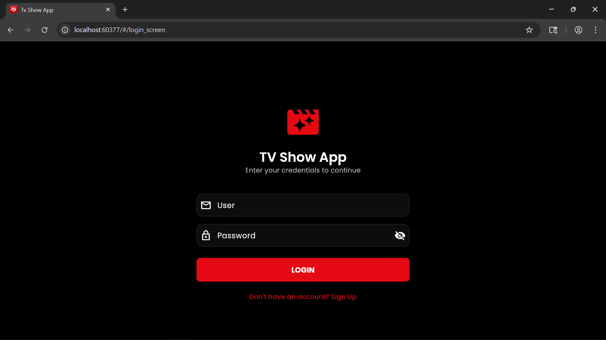
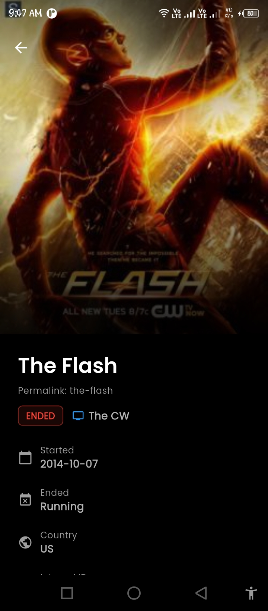
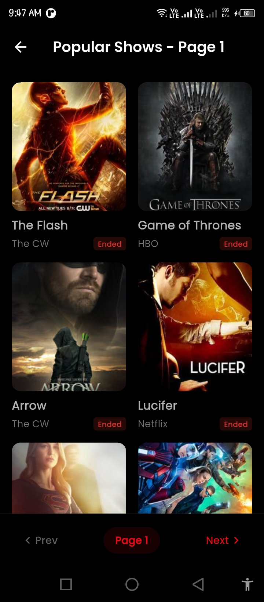
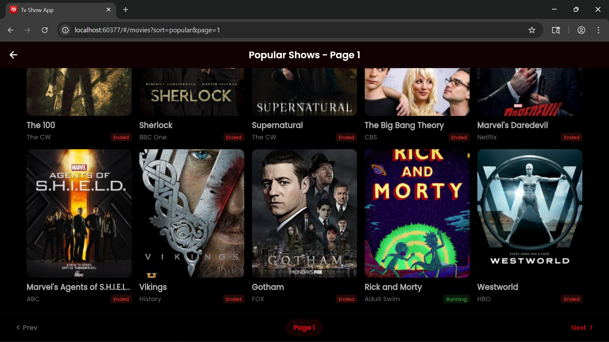

# 🎬 CineFlow: Enterprise-Grade Flutter TV Show Platform

A high-performance, scalable Flutter application built with **Clean Architecture** and **BLoC**. This project serves as a showcase of industrial-standard software engineering, featuring a robust network layer, cross-platform adaptivity, and a focus on maintainable code.

## 📱 Screenshots

| Screen | Mobile View | Desktop View |
| :--- | :---: | :---: |
| **Home** |  |  |
| **Login** |  |  |
| **Details** |  |  |
| **Pagination** |  |  |

## 🚀 Key Architectural Highlights

* **Clean Architecture (Feature-First):** Strict separation of layers (Domain, Data, Presentation) to ensure the codebase is testable and scalable.
* **Advanced BLoC State Management:** Implementation of independent BLoC instances to prevent UI cross-contamination, utilizing `buildWhen` and `Equatables` to optimize rendering performance.
* **Native Environment Security:** Implements **Compile-time Variables (`--dart-define`)** for secure API key management, following the standards of "Real-World Flutter."
* **Adaptive UI Engine:** A unified codebase that delivers a native feel across **iOS (Cupertino)**, **Android (Material 3)**, and **Flutter Web**.
* **Robust Network Layer:** A custom-built HTTP service with a dedicated Exception Handler, automatic JSON decoding, and integrated timeout/retry logic.

## ✨ Features

* **Dynamic Path Routing:** Implements RESTful URL structures (e.g., `/tv-show-details/the-flash`) for SEO-friendly web navigation and deep-linking.
* **Intelligent Pagination:** Fully paginated `GridView` with state-aware navigation (Prev/Next) and "smart loading" indicators.
* **Hero Motion Design:** Cinematic transitions between the catalog and detail views using the Flutter Hero framework.
* **Responsive Layouts:** Utilizes `ConstrainedBox` and `Sliver` layouts to provide an optimal viewing experience on ultra-wide web monitors and mobile screens alike.
* **Design System:** A comprehensive 15-style `TextTheme` using Google Fonts (Poppins), fully supporting **Dynamic Dark & Light Modes**.

## 🛠 Tech Stack

* **State Management:** [flutter_bloc](https://pub.dev/packages/flutter_bloc) (Event-driven architecture)
* **Architecture:** Clean Architecture + [get_it](https://pub.dev/packages/get_it) (Service Locator)
* **Networking:** [http](https://pub.dev/packages/http) with a custom BaseApiService wrapper
* **UI/UX:** [cached_network_image](https://pub.dev/packages/cached_network_image), Google Fonts, and Adaptive Icons
* **Tools:** Environment-specific launch configurations (`launch.json`) for CORS-disabled web debugging.

## 🏗 Project Structure

```text
lib/
 ┣ core/                 # Shared logic & infrastructure
 ┃ ┣ config/             # Routes, Theme, and Env handling
 ┃ ┣ constaints/         # App constants & API Endpoints
 ┃ ┣ exceptions/         # Custom error mapping
 ┃ ┣ network/            # HTTP clients & Network Service
 ┃ ┣ response/           # API Response wrappers
 ┃ ┣ storage/            # Local preferences/Hive/Secure Storage
 ┃ ┗ utils/              # Extensions & Enums
 ┣ features/             # Business Logic & UI (The Core of the App)
 ┃ ┣ tv_show/            # TV Show Feature
 ┃ ┃ ┣ data/             # Models, Data Sources & Repo Impl
 ┃ ┃ ┣ domain/           # Entities, Repositories (Abstract) & USECASES
 ┃ ┃ ┗ presentation/     # BLoCs, Pages, & Widgets
 ┃ ┣ auth/               # Authentication Feature
 ┃ ┗ splash/             # Startup Logic
 ┣ dependency_injection.dart # GetIt service locator
 ┗ main.dart             # App Entry point
```

## ⚙️ Configuration & Installation

### Environment Variables

This project uses `--dart-define` for security. To run with a custom API key:

```bash
flutter run --dart-define=API_KEY=your_key_here
```

### Web Development (CORS)

For testing on Flutter Web, use the provided VS Code launch configuration or run:

```bash
flutter run -d chrome --web-browser-flag "--disable-web-security"
```

## 📈 Engineering Growth Tracker

* [x] Implemented **Hero Animations** for professional-grade UX.
* [x] Solved **CORS restrictions** for cross-platform web deployment.

---
**Developed by Saif Ullah** *Software Developer specializing in high-performance Flutter architectures.*
